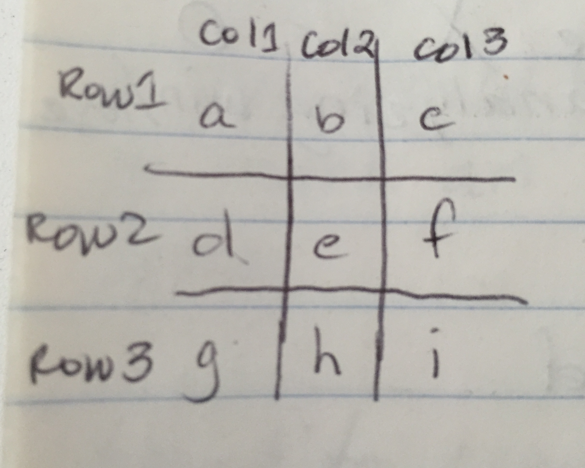

# WDI Project One: Tic-Tac-Toe Game

##Objective
To create a two-player tic tac toe game using HTML, CSS, Bootstrap and jQuery.

##Minimum Viable Product
The MVP for this project was to create a two-player game that could be played
once through in the browser and subsequent games could be played by refreshing
the browser window.

##Initial Sketches for Game Interface & Logic Organization

 

* * *
##Project Final Features
<ul>Users Can Do the Following:
    <li>Enter their names</li>
    <li>Play a game</li>
    <li>Play multiple rounds with each other</li>
    <li>Keep track of wins each round</li>
    <li>Keep playing even in the event of a tie</li>
    <li>Start a new game with new players</li>
</ul>
